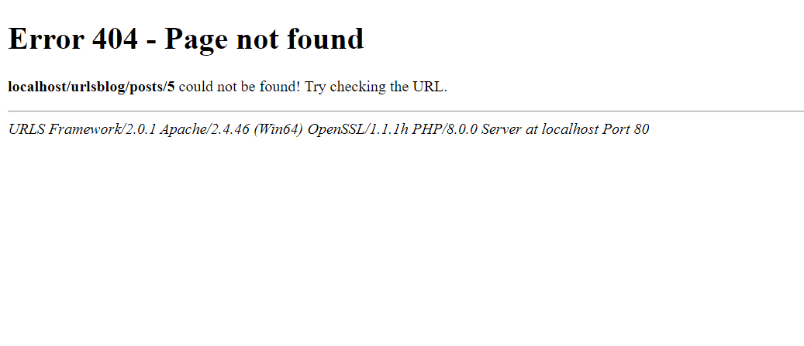

# HTTP Errors
In the [last section](variable.md), if a post was not found, then the user would be redirected to [localhost/posts](http://localhost/posts). This is not the best way to handle error. A better way is to call a 404 error. Luckily, URLS helps with that.
## Calling Errors
1. In `posts.php` change the if statement right after the `$posts` definition to:
   ```PHP
   if (isset(Urls::$access['post'])) {
       if (isset($posts[Urls::$access['post']])) {
           $pageTitle = $posts[Urls::$access['post']]['title'];
       } else {
           Urls::$self->error_404();
       }
   } else {
       $pageTitle = 'Posts';
   }
   ```
   The file should now look like:
   ```PHP
   <?php
   
   $posts = array(
       '1'=>array('title'=>'Post One', 'content'=>'Lorem ipsum dolor sit amet, consectetur adipiscing elit. Quisque in scelerisque nibh, et mattis nunc. Aliquam cursus placerat ex in varius. Phasellus urna elit, aliquam nec nulla ac, fringilla blandit justo. Nulla facilisi. Pellentesque non orci non urna venenatis egestas. Quisque gravida mi sed dui fermentum, eu tincidunt elit cursus. Sed lobortis ut turpis quis pretium. Phasellus accumsan tempus commodo. Proin nisi justo, mollis in faucibus ut, mattis a dolor. Ut congue mi tortor, nec pharetra tellus pretium non. Maecenas finibus, sapien in eleifend efficitur, risus magna volutpat sem, nec iaculis risus enim non tellus. Fusce lacinia odio a nibh molestie tincidunt. Aenean nec dui leo.'),
       '2'=>array('title'=>'Post Two', 'content'=>'Nam mattis lacus id sem vulputate, vel congue nulla consectetur. Sed euismod justo eu urna molestie efficitur. Suspendisse egestas mattis feugiat. Fusce viverra varius sem. Fusce sed sollicitudin ipsum. Sed pulvinar vulputate eros, eget lobortis mi lacinia eget. Nunc egestas id velit id pellentesque. Nam aliquam vestibulum nunc at varius. Donec mauris nisl, pretium ac tempus eget, pulvinar non elit.'),
       '3'=>array('title'=>'Post Three', 'content'=>'Praesent gravida suscipit hendrerit. Donec in purus hendrerit, mattis quam vel, fermentum odio. Nulla non elit molestie, tincidunt odio at, lacinia magna. Donec id elementum elit. Morbi consectetur urna arcu, dignissim dictum velit vulputate vitae. Integer sed varius lorem, a vestibulum felis. Ut tempor tortor vitae lorem posuere volutpat. Morbi consectetur neque viverra est laoreet, et faucibus turpis sagittis. In sit amet est quis enim euismod euismod. Integer sed nisi malesuada, iaculis ante vel, tempus nisl. Nulla ex risus, facilisis et ullamcorper eget, accumsan at erat. Ut vitae mollis augue, nec bibendum libero. Integer non leo eget risus euismod ornare vitae nec purus. Nam tincidunt aliquet elit.'),
   );
   
   if (isset(Urls::$access['post'])) {
       if (isset($posts[Urls::$access['post']])) {
           $pageTitle = $posts[Urls::$access['post']]['title'];
       } else {
           Urls::$self->error_404();
       }
   } else {
       $pageTitle = 'Posts';
   }
   
   include './includes/header.inc.php';
   
   if (isset(Urls::$access['post']) && isset($posts[Urls::$access['post']])) {
       ?>
       <h1><?php echo $posts[Urls::$access['post']]['title']; ?></h1>
       <p><?php echo $posts[Urls::$access['post']]['content'] ?></p>
       <?php 
   } else { 
       for ($i=0; $i < count($posts); $i++) {
           ?>
           <h1><a href="<?php echo Urls::$base.'posts/'.urlencode($i + 1); ?>"><?php echo $posts[strval($i + 1)]['title']; ?></a></h1>
           <p><?php echo $posts[strval($i + 1)]['content'] ?></p>
           <?php
       }
   }
       
   ?>
   
   <?php include './includes/footer.inc.php'; ?>
   ```
2. If you try to go to any post that does not exist like [localhost/posts/5](http://localhost/posts/5), you will get a 404 error.
   <picture>
       
   </picture>
## Explanation
This section has a couple new parts to it, the first one being the `Urls::$self` variable. This variable works like the `$this` variable. It contains the current instance of the `Urls` class. So why wouldn't you just use `$this`? The reason is because `$this` refers to the current object. While `$this` will usually work, if you are working inside another class within your file, `$this` will no longer refer the current `Urls` instance. Instead of `Urls::$self`, we could have used `end(Urls::$objects)`. This variable is an array that holds every instance of the `Urls` class called to get to this point in the order they were visited.
___
[Previous: Variable Paths](variable.md)  
[Next: HTTP Errors (part 2)](errors_p2.md)
