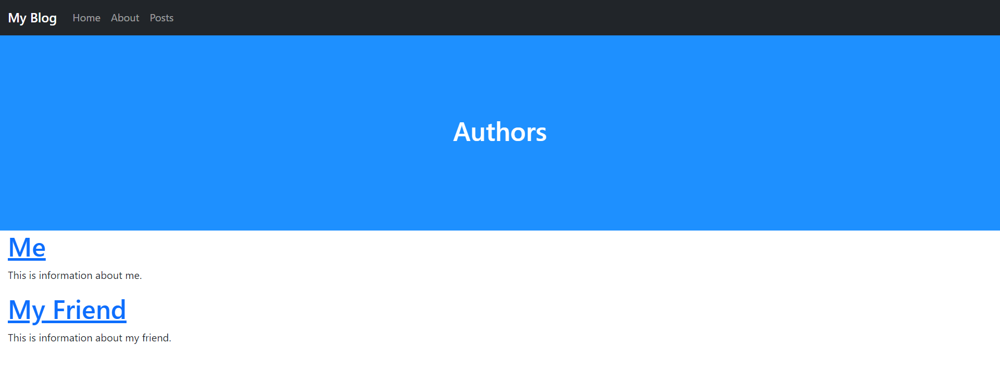

# Nesting Pages (part 1)
Now it is time to disscuss one of the more advanced features of URL, page nesting. The next few sections will show you the three ways to handle subpaths in URLS.

## Simple Nesting
This is the easiest method to create subpaths. It is simply listing them out in the settings file.
1. Start by creating a new page in `template` called `authors.php` and fill it with:
   ```PHP
   <?php
   $pageTitle = 'Authors';
   include './includes/header.inc.php';
   ?>
   
   <h1><a href="<?php echo Urls::$base; ?>about/authors/Me">Me</a></h1>
   <p>This is information about me.</p>
   
   <h1><a href="<?php echo Urls::$base; ?>about/authors/My-Friend">My Friend</a></h1>
   <p>This is information about my friend.</p>
   
   <?php include './includes/footer.inc.php'; ?>
   ```
2. Now go to `about.php` and add the following under the `<p>` tag:
   ```HTML
   <h1>Authors</h1>
   <p><a href="<?php echo Urls::$base; ?>about/authors">Learn more about the authors!<a></p>
   ```
   The full file should now look like:
   ```PHP
   <?php
   $pageTitle = 'About';
   include './includes/header.inc.php';
   ?>
   
   <h1>My Blog</h1>
   <p>This is information about my blog!</p>
   <h1>Authors</h1>
   <p><a href="<?php echo Urls::$base; ?>about/authors">Learn more about the authors!<a></p>
   
   <?php include './includes/footer.inc.php'; ?>
   ```
3. Now, add the path `$urls->path('about/authors/', 'templates/authors.php', true);` to `settings.php`:
   ```PHP
   <?php
   /*
   URLS framework url config file.
   
   Add your paths here:
   ex. $urls->path('blog/', 'blog-home.php', true);
   */
   include 'urls/Urls.php';
   Urls::$base = '/urlsblog/';
   
   $urls = new Urls;
   $urls->path('/', 'templates/home.php', true);
   $urls->path('about/', 'templates/about.php', true);
   $urls->path('about/authors/', 'templates/authors.php', true);
   
   $urls->exe();
   
   ?>
   ```
4. If you go to [localhost/about/authors](http://localhost/about/authors), you should see:
   <picture>
       
   </picture>
5. Now lets add a few more pages. In the `templates` folder, create two new files, `Me.php` and `My-Friend.php`.
6. Fill `Me.php` with:
   ```PHP
   <?php
   $pageTitle = 'About Me';
   include './includes/header.inc.php';
   ?>
   
   <h1>Me</h1>
   <p>This is information about me.</p>
   
   <?php include './includes/footer.inc.php'; ?>
   ```
7. Fill `My-Friend.php` with:
   ```PHP
   <?php
   $pageTitle = 'About My Friend';
   include './includes/header.inc.php';
   ?>
   
   <h1>My Friend</h1>
   <p>This is information about my friend.</p>
   
   <?php include './includes/footer.inc.php'; ?>
   ```
8. Finally, add `$urls->path('about/authors/Me', 'templates/Me.php', true);` and `$urls->path('about/authors/My-Friend', 'templates/My-Friend.php', true);` to `settings.php`:
   ```PHP
   <?php
   /*
   URLS framework url config file.
   
   Add your paths here:
   ex. $urls->path('blog/', 'blog-home.php', true);
   */
   include 'urls/Urls.php';
   Urls::$base = '/urlsblog/';
   
   $urls = new Urls;
   $urls->path('/', 'templates/home.php', true);
   $urls->path('about/', 'templates/about.php', true);
   $urls->path('about/authors/', 'templates/authors.php', true);
   $urls->path('about/authors/Me', 'templates/Me.php', true);
   $urls->path('about/authors/My-Friend', 'templates/My-Friend.php', true);
   
   $urls->exe();
   
   ?>
   ```
9. You should now be able to go to [localhost/about/authors/Me](http://localhost/about/authors/Me) and [localhost/about/authors/My-Friend](http://localhost/about/authors/My-Friend).
___
[Previous: More Pages](pages.md)  
[Next: Nesting Pages (part 2)](nesting_p2.md)
