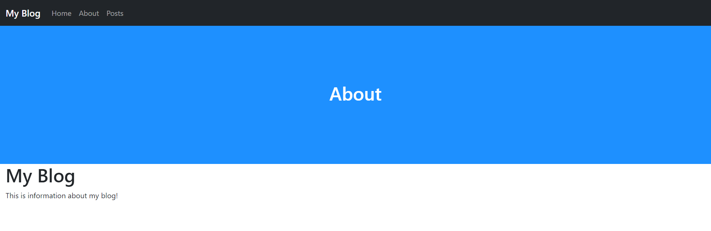

# More Pages
Now it's time to create some more pages!
1. Create a new file in the templates directory called `about.php` and fill it with:
   ```PHP
   <?php
   $pageTitle = 'About';
   include './includes/header.inc.php';
   ?>
   
   <h1>My Blog</h1>
   <p>This is information about my blog!</p>
   
   <?php include './includes/footer.inc.php'; ?>
   ```
2. Now add `$urls->path('about/', 'templates/about.php', true);` under the home path declaration in `settings.php`:
   ```PHP
   <?php
   /*
   URLS framework url config file.
   
   Add your paths here:
   ex. $urls->path('blog/', 'blog-home.php', true);
   */
   include 'urls/Urls.php';
   Urls::$base = '/urlsblog/';
   
   $urls = new Urls;
   $urls->path('/', 'templates/home.php', true);
   $urls->path('about/', 'templates/about.php', true);
   
   $urls->exe();
   
   ?>
   ```
3. If you go to [localhost/about](http://localhost/about), you should see:
   <picture>
       
   </picture>
___
[Previous: Static Files](static_files.md)  
[Next: Nesting Pages](nesting.md)
