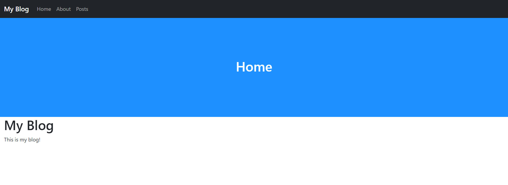

# Static Files
URLS makes it easy to link static files, such as CSS and JavaScript files to HTML. Unlike other web frameworks, you don't have to register your static files before using them. URLS only redirects requests to PHP files and directories so you can directly access any static files in any subfolder.
## Adding a Custom Style Sheet
Next, lets add a banner styled with a custom CSS file.
1. Create a new file in the `static` folder called `style.css` and fill it with the following code:
   ```CSS
   .header {
       height: 300px;
       background-color: DodgerBlue;
   }
   ```
2. Under `</nav>` in `header.inc.php`, add the following code.
   ```HTML
   <div class="header">
        <div class="container h-100">
            <div class="row h-100 align-items-center">
                <div class="col-12 text-center text-white">
                    <h1><?php if (isset($pageTitle)) echo $pageTitle; ?></h1>
                </div>
            </div>
        </div>
    </div>
   ```
3. Now it's time to link `style.css` to `header.inc.php`. Remember, all requests are going to be displayed as if it were in the base directory. To do this add the following line to the `<head>` of `header.inc.php`:
   ```HTML
   <link href="static/style.css" rel="stylesheet">
   ```
   Notice the `href` is pointing to `static/style.css` rather than `./static/style.css`.
4. The full `header.inc.php` file should now look like:
   ```HTML
   <!DOCTYPE html>
   <html>
   <head>
       <meta charset="utf-8">
       <meta name="viewport" content="width=device-width, initial-scale=1">
       <title><?php if (isset($pageTitle)) echo $pageTitle; ?> - My Blog</title>
       <link href="https://cdn.jsdelivr.net/npm/bootstrap@5.2.1/dist/css/bootstrap.min.css" rel="stylesheet">
       <script src="https://cdn.jsdelivr.net/npm/bootstrap@5.2.1/dist/js/bootstrap.bundle.min.js"></script>
       <link href="static/style.css" rel="stylesheet">
   </head>
   <body>
       <nav class="navbar navbar-expand-sm bg-dark navbar-dark">
           <div class="container-fluid">
               <a class="navbar-brand mb-0 h1" href="<?php echo Urls::$base; ?>">My Blog</a>
               <button class="navbar-toggler" type="button" data-bs-toggle="collapse" data-bs-target="#collapsibleNavbar">
                   <span class="navbar-toggler-icon"></span>
               </button>
               <div class="collapse navbar-collapse" id="collapsibleNavbar">
                   <ul class="navbar-nav">
                       <li class="nav-item">
                           <a class="nav-link" href="<?php echo Urls::$base; ?>">Home</a>
                       </li>
                       <li class="nav-item">
                           <a class="nav-link" href="<?php echo Urls::$base; ?>about">About</a>
                       </li>
                       <li class="nav-item">
                           <a class="nav-link" href="<?php echo Urls::$base; ?>posts">Posts</a>
                       </li>
                   </ul>
               </div>
           </div>
       </nav>
       <div class="header">
           <div class="container h-100">
               <div class="row h-100 align-items-center">
                   <div class="col-12 text-center text-white">
                       <h1><?php if (isset($pageTitle)) echo $pageTitle; ?></h1>
                   </div>
               </div>
           </div>
       </div>
       <div class="container-fluid">
   ```
5. The output of [localhost](http://localhost) should now be:
   <picture>
       
   </picture>
___
[Previous: Templates](templates.md)  
[Next: More Pages](pages.md)
