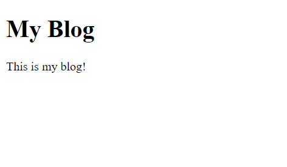

# Templates
Now we will begin building the actual blog!
## Setup
Start by creating a new file in the templates folder called `home.php` and fill it with:
```HTML
<!DOCTYPE html>
<html>
<head>
    <meta charset="utf-8">
    <meta name="viewport" content="width=device-width, initial-scale=1">
    <title>Home - My Blog</title>
</head>
<body>
    <h1>My Blog</h1>
    <p>This is my blog!</p>
</body>
</html>
```
Now, go to `settings.php` and change the second argument in the path method from `Urls::echo("Hello, World!")` to `"templates/home.php"`. The file should now look like:
```PHP
<?php
/*
URLS framework url config file.

Add your paths here:
ex. $urls->path('blog/', 'blog-home.php', true);
*/
include 'urls/Urls.php';
Urls::$base = '/urlsblog/';

$urls = new Urls;
$urls->path('/', 'templates/home.php', true);

$urls->exe();

?>

```
If you open up [localhost/](http://localhost/) again, you should see:  
<picture>
    
</picture>
