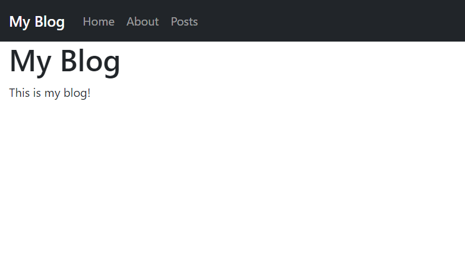

# Templates
Now we will begin building the actual blog!
## Setup
Start by creating a new file in the templates folder called `home.php` and fill it with:
```HTML
<!DOCTYPE html>
<html>
<head>
    <meta charset="utf-8">
    <meta name="viewport" content="width=device-width, initial-scale=1">
    <title>Home - My Blog</title>
</head>
<body>
    <h1>My Blog</h1>
    <p>This is my blog!</p>
</body>
</html>
```
Now, go to `settings.php` and change the second argument in the path method from `Urls::echo("Hello, World!")` to `"templates/home.php"`. The file should now look like:
```PHP
<?php
/*
URLS framework url config file.

Add your paths here:
ex. $urls->path('blog/', 'blog-home.php', true);
*/
include 'urls/Urls.php';
Urls::$base = '/urlsblog/';

$urls = new Urls;
$urls->path('/', 'templates/home.php', true);

$urls->exe();

?>

```
If you open up [localhost/](http://localhost/) again, you should see:  
<picture>
    
</picture>

## More Templates
Now that we covered the basics of URLS templates, we can combine it with traditional PHP templates.
1. Create two more files, `header.inc.php` and `footer.inc.php` in the includes folder.
2. Fill `header.inc.php` with the following code:
   ```HTML
   <!DOCTYPE html>
   <html>
   <head>
       <meta charset="utf-8">
       <meta name="viewport" content="width=device-width, initial-scale=1">
       <title><?php if (isset($pageTitle)) echo $pageTitle; ?> - My Blog</title>
       <link href="https://cdn.jsdelivr.net/npm/bootstrap@5.2.1/dist/css/bootstrap.min.css" rel="stylesheet">
       <script src="https://cdn.jsdelivr.net/npm/bootstrap@5.2.1/dist/js/bootstrap.bundle.min.js"></script>
   </head>
   <body>
       <nav class="navbar navbar-expand-sm bg-dark navbar-dark">
           <div class="container-fluid">
               <a class="navbar-brand mb-0 h1" href="#">My Blog</a>
               <button class="navbar-toggler" type="button" data-bs-toggle="collapse" data-bs-target="#collapsibleNavbar">
                   <span class="navbar-toggler-icon"></span>
               </button>
               <div class="collapse navbar-collapse" id="collapsibleNavbar">
                   <ul class="navbar-nav">
                       <li class="nav-item">
                           <a class="nav-link" href="#">Home</a>
                       </li>
                       <li class="nav-item">
                           <a class="nav-link" href="#">About</a>
                       </li>
                       <li class="nav-item">
                           <a class="nav-link" href="#">Posts</a>
                       </li>
                   </ul>
               </div>
           </div>
       </nav>
       <div class="container-fluid">
   ```
3. Now, fill `footer.inc.php` with the following code:
   ```HTML
       </div>
   </body>
   </html>
   ```
4. Finally, replace the code in `home.php` with the following:
   ```PHP
   <?php
   $pageTitle = 'Home';
   include './includes/header.inc.php';
   ?>
   
   <h1>My Blog</h1>
   <p>This is my blog!</p>
   
   <?php include './includes/footer.inc.php'; ?>
   ```
5. The result should look like this:
   <picture>
       
   </picture>
   
## Explanation
There is not much to explain here since this is mostly regular PHP and HTML and you should already have a good knowledge of it. Just like any other PHP program you make; you can include other PHP files without interfering in URLS. The biggest difference here is that URLS automatically protects your template files. With a regular PHP website, any user can easily access your template files, which could result in unwanted behavior. With URLS, the only PHP files users can access is the ones that are set in the path functions.
___
[Previous: Templates](templates.md)  
[Next: Static Files](static_files.md)
