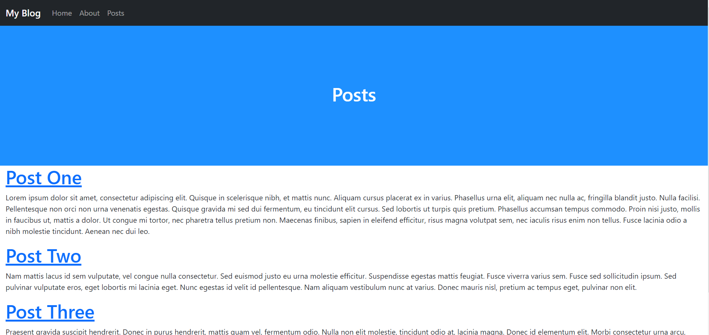
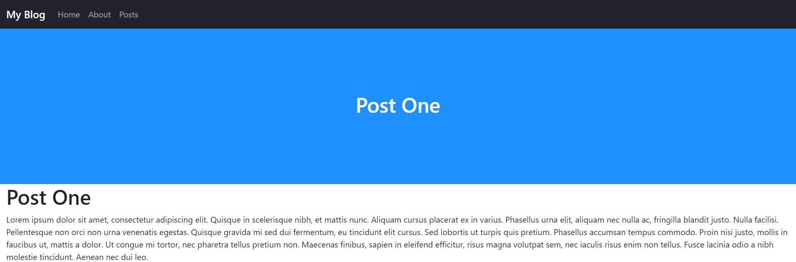

# Variable Paths
Variable paths (also called Variable URLs) are a very useful feature in URLS. They are similar to query strings except the query part is part of the url. In this section, we will build the post system. Since tutorial is meant to help you learn how to use URLS, we are going to take some shortcuts so we can focus on the URLS parts more. Specifically, we will not be using a database, instead we will just use an array and we will not allow users to write and edit posts.

1. Create a new file in templates called `posts.php` and fill it with the following:
   ```PHP
   <?php
   
   $posts = array(
       '1'=>array('title'=>'Post One', 'content'=>'Lorem ipsum dolor sit amet, consectetur adipiscing elit. Quisque in scelerisque nibh, et mattis nunc. Aliquam cursus placerat ex in varius. Phasellus urna elit, aliquam nec nulla ac, fringilla blandit justo. Nulla facilisi. Pellentesque non orci non urna venenatis egestas. Quisque gravida mi sed dui fermentum, eu tincidunt elit cursus. Sed lobortis ut turpis quis pretium. Phasellus accumsan tempus commodo. Proin nisi justo, mollis in faucibus ut, mattis a dolor. Ut congue mi tortor, nec pharetra tellus pretium non. Maecenas finibus, sapien in eleifend efficitur, risus magna volutpat sem, nec iaculis risus enim non tellus. Fusce lacinia odio a nibh molestie tincidunt. Aenean nec dui leo.'),
       '2'=>array('title'=>'Post Two', 'content'=>'Nam mattis lacus id sem vulputate, vel congue nulla consectetur. Sed euismod justo eu urna molestie efficitur. Suspendisse egestas mattis feugiat. Fusce viverra varius sem. Fusce sed sollicitudin ipsum. Sed pulvinar vulputate eros, eget lobortis mi lacinia eget. Nunc egestas id velit id pellentesque. Nam aliquam vestibulum nunc at varius. Donec mauris nisl, pretium ac tempus eget, pulvinar non elit.'),
       '3'=>array('title'=>'Post Three', 'content'=>'Praesent gravida suscipit hendrerit. Donec in purus hendrerit, mattis quam vel, fermentum odio. Nulla non elit molestie, tincidunt odio at, lacinia magna. Donec id elementum elit. Morbi consectetur urna arcu, dignissim dictum velit vulputate vitae. Integer sed varius lorem, a vestibulum felis. Ut tempor tortor vitae lorem posuere volutpat. Morbi consectetur neque viverra est laoreet, et faucibus turpis sagittis. In sit amet est quis enim euismod euismod. Integer sed nisi malesuada, iaculis ante vel, tempus nisl. Nulla ex risus, facilisis et ullamcorper eget, accumsan at erat. Ut vitae mollis augue, nec bibendum libero. Integer non leo eget risus euismod ornare vitae nec purus. Nam tincidunt aliquet elit.'),
   );
   
   if (isset(Urls::$access['post']) && isset($posts[Urls::$access['post']])) {
       $pageTitle = $posts[Urls::$access['post']]['title'];
   } else {
       $pageTitle = 'Posts';
   }
   
   include './includes/header.inc.php';
   
   if (isset(Urls::$access['post']) && isset($posts[Urls::$access['post']])) {
       ?>
       <h1><?php echo $posts[Urls::$access['post']]['title']; ?></h1>
       <p><?php echo $posts[Urls::$access['post']]['content'] ?></p>
       <?php 
   } else { 
       for ($i=0; $i < count($posts); $i++) {
           ?>
           <h1><a href="<?php echo Urls::$base.'posts/'.urlencode($i + 1); ?>"><?php echo $posts[strval($i + 1)]['title']; ?></a></h1>
           <p><?php echo $posts[strval($i + 1)]['content'] ?></p>
           <?php
       }
   }
       
   ?>
   
   <?php include './includes/footer.inc.php'; ?>
   ```
2. Add the paths `$urls->path('posts/', 'templates/posts.php', true);` and `$urls->path('posts/<post>/', 'templates/posts.php', true);` to the `$urls` instance in `settings.php`:
   ```PHP
   <?php
   /*
   URLS framework url config file.
   
   Add your paths here:
   ex. $urls->path('blog/', 'blog-home.php', true);
   */
   include 'urls/Urls.php';
   Urls::$base = '/urlsblog/';
   
   $contributors = new Urls;
   $contributors->path('/', 'templates/contributors.php', true);
   $contributors->path('Me', 'templates/Me.php', true);
   $contributors->path('My-Friend', 'templates/My-Friend.php', true);
   $contributors->path('Another-Friend', 'templates/Another-Friend.php', true);
   
   $urls = new Urls;
   $urls->path('/', 'templates/home.php', true);
   $urls->path('about/', 'templates/about.php', true);
   $urls->path('about/authors/', 'authors_settings.php');
   $urls->path('about/contributors/', $contributors);
   $urls->path('posts/', 'templates/posts.php', true);
   $urls->path('posts/<post>/', 'templates/posts.php', true);
   
   $urls->exe();
   
   ?>
   ```
3. If you go to [localhost/posts](http://localhost/posts), you should see:
   <picture>
       
   </picture>
4. If you go to [localhost/posts/1](http://localhost/posts/1), you should see:
   <picture>
       
   </picture>

## Explanation
This section has a lot going on. The first thing to note is `Urls::$access` variable. Like `$_POST` and `$_GET`, `Urls::$access` is an array containing all the variable URLs. The key to the array is the ID assigned in the path. How you define a variable ID in the path is in the first argument of the `path()` function, in the place you want the variable, enter `<(ID)>` where `(ID)` is the ID you want. In this example, the path is `'posts/<post>/'` so to access it, you would use `Urls::$access['post']`.
___
[Previous: Nesting Pages (part 3)](nesting_p3.md)  
[Next: Errors](errors.md)
