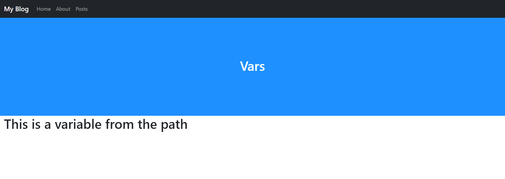

# Passing Variables
The last argument in a path is the variables argument. The variables argument is an array that allow you to pass a variable to the page that is being displayed.
1. Create a new file in templates called `vars.php` and fill it with:
   ```PHP
   <?php
   $pageTitle = 'Vars';
   include './includes/header.inc.php';
   ?>
   
   <h1><?php echo Urls::$vars[0]; ?></h1>
   
   <?php include './includes/footer.inc.php'; ?>
   ```
2. Add `$urls->path('vars/', 'templates/vars.php', true, true, array("This is a variable from the path"));` to `$urls` in `settings.php`. The file should now look like:
   ```PHP
   <?php
   /*
   URLS framework url config file.
   
   Add your paths here:
   ex. $urls->path('blog/', 'blog-home.php', true);
   */
   include 'urls/Urls.php';
   Urls::$base = '/';
   Urls::$defaultErrors[404] = "errors/404.php";
   Urls::$cs = true;
   
   $contributors = new Urls;
   $contributors->errors[404] = "errors/contributors_404.php";
   $contributors->path('/', 'templates/contributors.php', true);
   $contributors->path('Me', 'templates/Me.php', true);
   $contributors->path('My-Friend', 'templates/My-Friend.php', true);
   $contributors->path('Another-Friend', 'templates/Another-Friend.php', true);
   
   $urls = new Urls;
   $urls->path('/', 'templates/home.php', true);
   $urls->path('about/', 'templates/about.php', true);
   $urls->path('about/authors/', 'authors_settings.php');
   $urls->path('about/contributors/', $contributors);
   $urls->path('posts/', 'templates/posts.php', true);
   $urls->path('posts/<post>/', 'templates/posts.php', true);
   $urls->path('home/', 'templates/home.php', true, false);
   $urls->redirect('post1/', Urls::$base.'posts/1');
   $urls->redirect('URLS/', 'https://github.com/urls-framework/URLS', false, 302);
   $urls->path('vars/', 'templates/vars.php', true, true, "This is a variable from the path");
   
   $urls->exe();
   
   ?>
   ```
3. If you go to [localhost/vars](http://localhost/vars), you should see:
   <picture>
       
   </picture>
___
[Previous: Redirects](redirects.md)  
[Next: Conclusion](conclusion.md)
